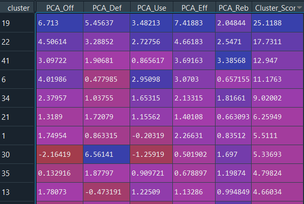
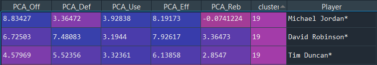
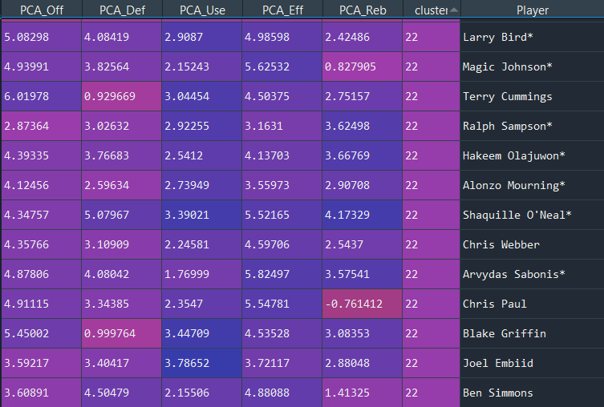
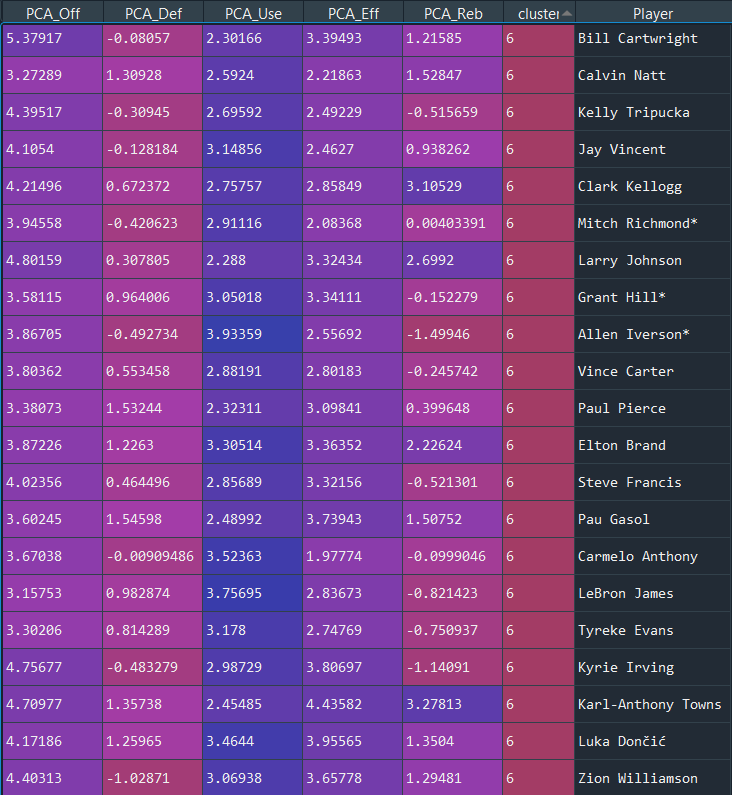
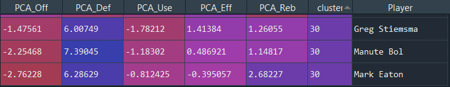

# NBA_Rookie_Clustering

## Overview
This project focuses on attempting to evaluate NBA players' rookie season performance. I look at every player's rookie season stats going back to the 1979-1980 NBA season and compare them against each other to see the best and worst of rookie players for the past 40 years. There are some interesting questions this may be able to answer.... Which NBA players were the best rookies? How good was the very hyped Zion Williamson? Which NBA players were the most similar to each other as rookies? Do certain clusters of players show a trend that could be used for future predictions or career projections? Some of the results may surprise you.

## Resources Used
-Python with Spyder IDE.
-Tableau
-Basketball Reference

## Methodology
The steps I took to complete this project included web scraping multiple pages on Basketball Reference to create a dataset. I scraped NBA rookie season stats, per 36 min stats, and the advanced stats. I then joined the names and age from each rookie season with the statistics that matched those players in the per 36 and advanced stats pages. This dataset is the All_Rookies csv in this repository.

Once I had all the data put together I kept rookies that played more then 9 games in their rookie season and then rookies that played more than 90 total minutes. This dataset is the Kept_Rookies csv that is in this repository. At this point I have 45 columns that represent different statistics for each players performance and then 4 columns describing the player which includes their name, team, age, and position.

My next step would be to attempt to create clusters that will group players together based on their statistical performance, but there is a problem. Trying to use 45 columns to evaluate groups of players gives us 45 different dimensions. If you imagine a 2d line graph there are just 2 dimensions, the x and y axis. Now imagine 45 dimensions, this makes it hard to give us clusters.

So to fix this problem I reduced the amount of columns I want to use to evaluate players down to 16 specific columns. I then used a method called principal component analysis to reduce those 16 columns even further down to 5 columns. These 5 columns represent a "score" based on several other columns. The 5 "score" columns are shown in the below table along with the statistical columns used to create their score. I focused on having an offensive, defensive, usage, efficiency, and rebounding score. Each score is meant to take all other players into consideration. meaning that a score of 0 in a category would mean that player is the average performer for that category. A positive score is better than average and negative is worse than average. Basically the higher the score the better that player performed in that area.

PCA_Off | PCA_Def | PCA_Use | PCA_Eff | PCA_Reb
----- | ---------------- | ---- | ------ | ------
Assists Per 36 min | Steals per 36 min | Average Min per game | Value Over Replacement Player | Offensive Rebounds per 36 min
Points per 36 min | Blocks per 36 min | Usage % | Player Efficiency Rating | Defensive Rebounds per 36 min
Offensive Win Shares | Defensive Win Shares | | True Shooting % | Total Rebounds per 36 min
Offensive Box Plus Minus | Defensive Box Plus Minus | | |

Now, I can finally create the clusters that will show players who performed the most similar with each other in their rookie seasons. Another decision i had to make was how many clusters should I create? There is no right answer to this and I needed to take into consideration that there were 1,755 players I was performing this analysis on. If I want each cluster to have 10 similar players then that would mean I would need to create almost 175 clusters. That seemed a little too much to me and clusters wouldn't necessarily be grouped into equal amounts of players. Therefore, I decided to go until clusters started to get down to less than 5 players in some instances. All in all, I created 42 clusters of players. The dataset that contains the scores with players and their associated cluster is called pca_Rookie_Cluster csv.

## Results

Now for the fun part, looking at the results! One thing I did was look at the average scores for each cluster to get an idea of which players were the highest performing rookies. We can see this in the below image.

It looks like cluster 19 really outperformed the other rookie clusters significantly. So lets see what players made up that cluster.

### Cluster 19 

Cluster 19 was only made up of 3 rookie players, one being Michael Jordan. Are we really that surprised? MJ is joined with fellow hall of fame players David Robinson and Tim Duncan. Based on this cluster and their scores we could argue that these three had the best performing rookie seasons in the past 40 years.

### Cluster 22

The second highest performing cluster also contained a list of hall of famers and future hall of famers. Larry Bird and Magic Johnson both being drafted in the same year really shows how awesome the 1979-1980 season must have been. Having Ben Simmons and Joel Embiid included in this list is a good sign for you 76er fans!

### Cluster 41

Here we have a dominant big man cluster. Led by hof players like Charles Barkley and Yao Ming along with a lot of current star bigs who are playing today. However, there are a few names I do not recognize such as Jeff Ruland who turns out was a pretty decent center/power forward in the 80's.

### Where's Zion? Lebron James?

Remember, we are only looking at rookie season stats so some very good players may not have had a great rookie season such as Giannis Antetokounmpo and were places into a less than great cluster. As far as Zion and Lebron, they were both placed into the 4 best performing cluster, cluster 6.

Here we have a lot of high profile names such as Lebron James, Carmelo Anthony, and Grant Hill. The future seems to be bright for Luka Doncic and Zion Williamson.

### Honorable Mention

I just wanted to show this cluster as a fun result. This was the only other cluster with just 3 players in it and I thought it was funny that Greg Stiemsma was placed with Manute Bol and Mark Eaton.

## Conclusion

This was a fun project and interesting way to evaluate which players were most "NBA Ready" when they came into the league. I feel that this method also can give future insights into what we can expect from players in the future. Feel free to download the csv files and look for players you may be interested in. Thank you for taking the time to look at my page and feel free to ask me any questions.
